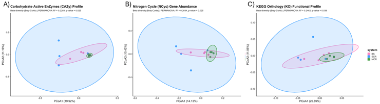

# Taxonomic Characterization and Functional Potential of Carbon and Nitrogen Cycles in the Carrot Rhizosphere

End-to-end HPC-ready bioinformatic pipeline for profiling bacterial taxonomic diversity and metabolic functions (specifically Carbon and Nitrogen cycles) in *Daucus carota* L. rhizosphere soils under distinct agricultural management systems. Processes shotgun metagenomic datasets from public SRA repositories, tracking shifts in community structures and reconstructing functional enzyme abundance profiles.

**Figure 1. Study design and sampling.** In A, the experimental fieldwork layout in Gauteng Province, South Africa, showcasing rhizosphere soil collection zones at a depth of 0–15 cm, exactly 50 days post-sowing. B highlights the comparison strategy between continuous intensive monoculture, crop rotation footprints, and pristine native bulk soils.

## Background

Intensive agricultural cultivation often alters soil biodiversity, impacting long-term crop productivity and nutrient cycling capacity. Understanding how microbial functional groups adapt to varying soil-management regimes is key to developing sustainable biological interventions. This project evaluates how different cropping histories shape the rhizosphere microbiome of *Daucus carota* L., utilizing shotgun metagenomic sequencing (Illumina NovaSeq X Plus) to monitor the distribution of Carbohydrate-Active Enzymes (CAZymes) and key functional marker genes driving the terrestrial Nitrogen cycle.

This repository contains the high-performance computing cluster batch scripts (SLURM) and downstream data-wrangling Python scripts built to extract quantitative environmental insights from these metagenomic datasets.

## Pipeline Overview

                 Raw Sequencing FastQ Reads (SRA)
                                │
                                ▼
                    sh_utilizados/Q_*.sh [SLURM]
         ┌──────────────────────────────────────────────┐
         │ · Treatment-specific trimming & QC           │
         │ · Verified via fastqc_*_clean.sh jobs        │
         └──────────────────────────────────────────────┘
                                │
                                ▼
                 ┌──────────────┴──────────────┐
                 ▼                             ▼
         [Taxonomy Stream]             [Functional Stream]
          1.Taxonomy [SLURM]            1.Megahit [SLURM]
                 │                             │
          2.Bracken [SLURM]             2.Prodigal [SLURM]
                 │                             │
         02_build_taxonomy.py          3.dbCAN_full / 3.eggNOG / 4.NCyc
                 │                             │
         03_filter_bacteria.py         01_clean_functional_hits.py
                 └──────────────┬──────────────┘
                                ▼
                  Matrix Assembly Optimization
         ┌──────────────────────────────────────────────┐
         │ · 04_build_cazy_matrix.py                    │
         │ · 04_build_kegg_matrix.py                    │
         │ · 04_build_ncyc_matrix.py                    │
         └──────────────────────────────────────────────┘
                                │
                                ▼
                     Downstream Export Stage
         ┌──────────────────────────────────────────────┐
         │ · 05_bias_check.py (Sampling bias checks)    │
         │ · 06_export_ready_for_R.py                   │
         └──────────────────────────────────────────────┘
                                │
                                ▼
             Filtered Data Frames Ready for R Workspace

## 🧬 Script Execution Sequence

The pipeline steps visible in the environment directories (**image_ec1581.png** and **image_ec15a3.png**) follow a strict chronological dependency order:

### 1. Quality Control & Quality Filtering
Executed inside the `sh_utilizados/` subdirectory on the cluster using dedicated scripts per treatment block (`Q_BS.sh`, `Q_MCR.sh`, `Q_SCR.sh`). Clean datasets are validated using corresponding `fastqc_*_clean.sh` scripts.

### 2. Taxonomic Analysis
* `1.Taxonomy`: Maps clean reads using Kraken2 against reference k-mer databases.
* `2.Bracken`: Performs Bayesian estimation of relative abundances at targeted taxonomic levels.
* `02_build_taxonomy.py`: Parses cluster outputs into unified structural tables.
* `03_filter_bacteria.py`: Implements aggressive lineage verification, isolating strict bacterial variants and discarding environmental noise.

### 3. Assembly and Structural Annotation
* `1.Megahit`: Assembles normalized reads *de novo* into high-confidence metagenomic contigs.
* `2.Prodigal`: Scans generated contigs to predict open reading frames (ORFs) using customized metagenomic parameters.

### 4. Functional Assignment & Matrix Generation
* `3.dbCAN_full` / `3.eggNOG` / `4.NCyc`: Multi-threaded database screening jobs for tracking CAZymes, orthologous groups, and Nitrogen pathways.
* `01_clean_functional_hits.py`: Trims low-scoring hits and filters structural data.
* `04_build_*_matrix.py`: Trio of modules calculating the abundance frequencies for CAZymes, KEGG, and Nitrogen marker maps.
* `05_bias_check.py` & `06_export_ready_for_R.py`: Assesses parsing metrics and transforms functional sparse data into dense, normalized tables configured directly for R's `vegan` package.

## Repository Layout Reference

| File/Directory | Runtime Engine | Function |
| :--- | :--- | :--- |
| `code/sh_utilizados/` | Bash / SLURM | Handles parallel raw-read data cleaning operations grouped by biological field management. |
| `code/*.xml / *.slurm` | Bash / SLURM | High-performance computing workflows running heavy assemblies, structural gene calls, and alignments. |
| `code/*.py` | Python 3 | Data parsing processors converting multi-gigabyte database text files into relational abundance matrices. |

**Figure 2. Matrix transformation and normalization workflow.** The pipeline converts raw taxonomic and functional operational tables into highly filtered datasets: A) Unprocessed family-level reads containing low-count ambient variants. B) Target normalization where reads are scaled by total library size to isolate major biological shifts, highlighted in yellow. C) Clean functional/taxonomic core-community matrix acting as the exact filtered background input for robust multivariate statistical models.

## Experimental Context

| Parameter | Details |
| :--- | :--- |
| **Organism** | *Daucus carota* L. (Carrot Rhizosphere) |
| **Treatments** | MCR (Monoculture), SCR (Soybean Precedent), BS (Bulk Soil) |
| **Sequencing Technique** | Shotgun Metagenomics (Illumina NovaSeq X Plus, Paired-End 150 bp) |
| **Dataset Accessions** | SRA: SRP539180, SRP537154, SRP537537 |
| **Replication & Depth** | 4 biological replicates per treatment group; 0–15 cm sampling depth |
| **Primary Readout** | Taxonomic family abundance shifts & Nitrogen/CAZyme profile reconstructions |

## Authors

* **Angela Carolina Cabrera Jojoa** — Universidad de los Andes  
* **Juan Sebastian Zapata Acosta** — Microbiologist — MSc Candidate in Computational Biology · Universidad de los Andes  
  [GitHub](https://github.com/Juansebastianzapataacostaa) · [LinkedIn](https://www.linkedin.com/in/juan-sebastian-zapata-acosta-789bb6224) · 10.sebastian.zapa@gmail.com

## Citation

If you use this pipeline, code configurations, or report context in your academic work, please cite this repository using the metadata provided in the `CITATION.cff` file, or as follows:

> Zapata Acosta, J. S., & Cabrera Jojoa, A. C. (2026). Carrot Rhizosphere Metagenomics Pipeline (Version 1.0.0). GitHub Repository. https://github.com/Juansebastianzapataacostaa/carrot-rhizosphere-metagenomics

The complete project report and scientific context can be found in the `docs/` directory.
## License

MIT License — free to use with attribution.
